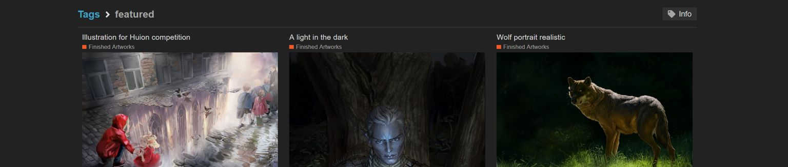

<html>
<h2>Fun with python in krita</h2>
<p>--- Under construction ---</p>

__version__ = 0.0.14

<p>Contains experimental example python plugins for Krita.
May give some ideas how to do things.</p>

<hr>
<h3>How to install</h3>
<pre>
```
copy files and folders from ./pykrita to
  linux/mac:  ${HOME}/.local/share/krita/pykrita
  win:        ${HOME}\AppData\Roaming\krita\pykrita
```
</pre>

<p>(Krita really should have some enviroment variable for plugin folders like
`KRITA_PLUGINS_PATH="/path/myplugins:/more/plugins:~/dev/krita_python_fun"`,
pleeease!, cherry on top!)</p>

<hr>


<h3>Arc Welding Tool</h3>
<p>How to add new tool to Krita.
Add button to toolbar
Show tool context gizmo in viewport.</p>
<hr>


<h3>Camera Layer</h3>
<p>Custom layer node that pulls pixels from camera.</p>
<hr>


<h3>Fetch Gallery</h3>
<p>Fetch image data from url to QImage,
and then push QImage to layer node.</p>
<hr>


<h3>Layer Extra Properties</h3>
<p>show extra secton in layer properties.
JSON tree of user defined settings.
(currntly JSON is stored in DublinCore.publisher field.)
(note: Krita bug in DublinCore.description, it is NOT saved!)</p>
<hr>


<h3>glTF Editor</h3>
<p>Realtime model viewer with textures as krita layers + UV map overlay. Can be used to render 3d scene image to layer. Lighting Plugin needed (glTF has light issues...) No 3D painting support!
</p>
<hr>

<h3>future ideas</h3>
<pre>
Krita Shelfs:
  - place scripts, actions with settings, filepaths, then just click or drag & drop to target
OpenStreetMap layer:
  - fetch any place on earth!
PixFika layer:
  - Shadertoy + glsl sandbox + PixFika compatible layer
Tutor:
  - interactive drawing tutor (Timelapse, maybe record strokes?)
Multi user Krita:
  - One document multiple interactive users. (sync layers + show fake cursors)
  - Also works as bridge from krita to other programs krita<->blender?
  - use <a href="https://doc.qt.io/qt-5/qsharedmemory.html">QSharedMemory</a> or <a href="https://docs.python.org/3/library/multiprocessing.shared_memory.html">shared_memory (py 3.8+)</a>
PyKrita Unit test runner:
  - graphical untit test runner with watchdog & auto start.
</pre>

<hr>

</html>
